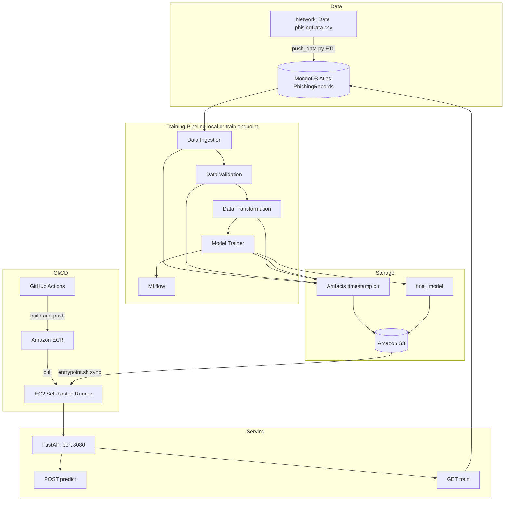

# Network Security MLOps — Full Project Documentation

**Author:** Safwen Cherif  
**Repository:** [github.com/SafwenCherif/networking-security-mlops](https://github.com/SafwenCherif/networking-security-mlops)  
**Problem domain:** Phishing website detection using URL and page-feature signals  
**Deployment:** FastAPI on AWS EC2, containerized with Docker, delivered via GitHub Actions CI/CD

---

## Table of Contents

1. [Executive Summary](#1-executive-summary)
2. [Technology Stack](#2-technology-stack)
3. [High-Level Architecture](#3-high-level-architecture)
4. [Project Timeline — What Was Built and Why](#4-project-timeline--what-was-built-and-why)
5. [Project Structure](#5-project-structure)
6. [File-by-File Reference](#6-file-by-file-reference)
7. [Machine Learning Pipeline — Deep Dive](#7-machine-learning-pipeline--deep-dive)
8. [Technology Integrations](#8-technology-integrations)
9. [CI/CD Pipeline](#9-cicd-pipeline)
10. [API Reference](#10-api-reference)
11. [Clone and Run Locally](#11-clone-and-run-locally)
12. [AWS Cloud Setup](#12-aws-cloud-setup)
13. [Docker and Production Deployment](#13-docker-and-production-deployment)
14. [GitHub Actions Secrets](#14-github-actions-secrets)
15. [Troubleshooting](#15-troubleshooting)
16. [Results and Metrics](#16-results-and-metrics)

---

## 1. Executive Summary

This project is an end-to-end **MLOps system** for detecting phishing websites. Raw tabular data describing URL and page characteristics is stored in **MongoDB Atlas**, processed through a modular **training pipeline**, tracked with **MLflow**, versioned in **Amazon S3**, served through a **FastAPI** application, and deployed automatically to **AWS EC2** using **Docker**, **Amazon ECR**, and **GitHub Actions**.

The design follows production MLOps principles:

- **Separation of concerns** — each pipeline stage is its own component with config and artifact entities.
- **Reproducibility** — timestamped artifact directories, schema validation, and experiment tracking.
- **Cloud-native delivery** — models and artifacts synced to S3; containers pushed to ECR; EC2 pulls and runs on every `main` push.
- **Operational API** — `/train` retrains the model; `/predict` scores new CSV uploads in real time.

---

## 2. Technology Stack

| Layer | Technology | Role |
|-------|------------|------|
| Language | Python 3.12 | Core application and ML code |
| Data store | MongoDB Atlas | Central feature/record store for training data |
| ML | scikit-learn | Preprocessing, model training, GridSearchCV |
| Experiment tracking | MLflow | Logs metrics and models per training run |
| Object storage | Amazon S3 | Pipeline artifacts and production model files |
| API | FastAPI + Uvicorn | REST endpoints for training and inference |
| Templating | Jinja2 | HTML prediction results page |
| Containerization | Docker | Portable application packaging |
| Container registry | Amazon ECR | Private Docker image storage |
| Compute | AWS EC2 (t3.micro) | Production inference server |
| CI/CD | GitHub Actions | Build, push, and deploy on every push to `main` |
| Secrets | GitHub Secrets + `.env` | Credentials for MongoDB, AWS, and runtime config |
| SSL for MongoDB | certifi | Trusted CA bundle for Atlas TLS connections |
| Config | python-dotenv | Load environment variables from `.env` |
| Packaging | setuptools (`setup.py`) | Install `networksecurity` as an editable package |

---

## 3. High-Level Architecture



### Request flow for inference

1. User uploads a CSV (30 feature columns, no `Result` label) to `POST /predict`.
2. FastAPI loads `final_model/preprocessor.pkl` and `final_model/model.pkl`.
3. `NetworkModel` applies preprocessing, runs the classifier, returns predictions as HTML.
4. On EC2, models are pulled from S3 at container startup via `entrypoint.sh`.

---

## 4. Project Timeline — What Was Built and Why

### Phase 1 — Project foundation

**Goal:** Establish a maintainable Python package with logging, exceptions, and version control.

| Step | What | Why |
|------|------|-----|
| Create `networksecurity/` package | Modular code layout | Scales as pipeline grows; importable from scripts and API |
| `setup.py` + `requirements.txt` | Reproducible dependencies | Anyone can `pip install -e .` and get the same environment |
| `networksecurity/logging/logger.py` | Timestamped file + console logs | Debug pipeline failures; audit training runs |
| `networksecurity/exception/exception.py` | Custom `NetworkSecurityException` | Consistent error messages with file name and line number |
| `.gitignore` | Exclude secrets, venv, artifacts | Prevent credential leaks and bloated commits |
| GitHub repository | Remote source of truth | Enables collaboration and CI/CD |

### Phase 2 — Data layer (MongoDB Atlas)

**Goal:** Move from a static CSV to a cloud database that the pipeline reads at training time.

| Step | What | Why |
|------|------|-----|
| MongoDB Atlas cluster | Managed NoSQL database | Scalable, cloud-accessible data store |
| `push_data.py` | ETL: CSV → JSON records → MongoDB | One-time (or repeatable) data load |
| `test_mongodb.py` | Connection smoke test | Verify Atlas URI and network access before pipeline runs |
| `.env` with `MONGO_DB_URL` | Secure credential storage | Never hardcode passwords in source code |
| Database `NetworkSecurityDB`, collection `PhishingRecords` | Canonical data location | Single source of truth for ingestion component |

**Why MongoDB instead of reading CSV directly in production?**

- Mirrors real MLOps patterns where training data lives in a managed store.
- Decouples data upload from training — retrain without redeploying data files.
- Atlas handles backups, scaling, and access control.

### Phase 3 — ML training pipeline

**Goal:** Build a four-stage pipeline with artifacts passed between components.

| Component | Responsibility |
|-----------|----------------|
| Data Ingestion | Read MongoDB → feature store CSV → train/test split |
| Data Validation | Schema checks + Kolmogorov–Smirnov drift detection |
| Data Transformation | KNN imputation, save numpy arrays + preprocessor |
| Model Trainer | GridSearchCV over 5 classifiers, MLflow logging, save best model |

**Why artifact entities?**

Each stage returns a dataclass (`DataIngestionArtifact`, etc.) describing output paths. The next stage only needs the artifact — not internal details of the previous step. This is the **pipeline composition pattern** used in production ML systems.

### Phase 4 — Experiment tracking (MLflow)

**Goal:** Record which model ran, with what metrics, for reproducibility.

- Default: `sqlite:///mlflow.db` (local).
- Logs F1, precision, recall for train and test runs.
- Optional: DagsHub remote URI via `.env` for team visibility.

**Why MLflow?**

Without experiment tracking, you cannot answer: *Which run produced the model in production? What was its test F1?*

### Phase 5 — Cloud artifact storage (Amazon S3)

**Goal:** Persist every pipeline run and the production model in durable object storage.

After training, `TrainingPipeline` syncs:

- `Artifacts/<timestamp>/` → `s3://<bucket>/artifact/<timestamp>/`
- `final_model/` → `s3://<bucket>/final_model/<timestamp>/`

**Why S3?**

- Artifacts survive local disk loss.
- EC2 containers can pull the latest model without baking it into the image.
- Enables rollback to a specific timestamp via `MODEL_S3_TIMESTAMP`.

### Phase 6 — API layer (FastAPI)

**Goal:** Expose training and inference over HTTP.

| Endpoint | Method | Purpose |
|----------|--------|---------|
| `/` | GET | Redirect to Swagger UI |
| `/train` | GET | Run full training pipeline + S3 sync |
| `/predict` | POST | Upload CSV, return HTML table with predictions |

**Why FastAPI?**

- Auto-generated OpenAPI docs at `/docs`.
- Async-ready, widely used in ML serving.
- Easy file upload for batch prediction.

### Phase 7 — Containerization (Docker)

**Goal:** Package the app so it runs identically on any machine.

- `Dockerfile` — Python 3.12 slim image, installs deps, exposes 8080.
- `entrypoint.sh` — Syncs latest model from S3 before starting Uvicorn.
- `.dockerignore` — Keeps venv, logs, and secrets out of the image.

**Why Docker?**

Eliminates "works on my machine" — the same image runs locally, in CI, and on EC2.

### Phase 8 — CI/CD (GitHub Actions + ECR + EC2)

**Goal:** Automate build, registry push, and deployment on every `main` push.

| Job | Runner | Action |
|-----|--------|--------|
| Continuous Integration | `ubuntu-latest` | Install deps, verify imports |
| Continuous Delivery | `ubuntu-latest` | Build Docker image, push to ECR |
| Continuous Deployment | Self-hosted on EC2 | Pull image, restart container, health check |

**Why a self-hosted runner on EC2?**

GitHub-hosted runners cannot deploy to your private EC2 instance. A runner on the same machine pulls from ECR and runs the container locally — simple, cost-effective for this architecture.

---

## 5. Project Structure

```
networking-security-mlops/
│
├── networksecurity/                 # Main Python package
│   ├── cloud/
│   │   └── s3_syncer.py             # AWS S3 folder sync wrapper
│   ├── components/
│   │   ├── data_ingestion.py        # Stage 1: MongoDB → feature store
│   │   ├── data_validation.py       # Stage 2: schema + drift
│   │   ├── data_transformation.py   # Stage 3: imputation + arrays
│   │   └── model_trainer.py         # Stage 4: train + MLflow
│   ├── constant/
│   │   └── training_pipeline/
│   │       └── __init__.py          # All pipeline constants
│   ├── entity/
│   │   ├── artifact_entity.py       # Dataclasses for stage outputs
│   │   └── config_entity.py         # Path/config objects per stage
│   ├── exception/
│   │   └── exception.py             # Custom exception class
│   ├── logging/
│   │   └── logger.py                # File + console logging setup
│   ├── pipeline/
│   │   └── training_pipeline.py     # Orchestrates all 4 stages + S3
│   └── utils/
│       ├── main_utils/
│       │   └── utils.py               # YAML, pickle, numpy, GridSearchCV
│       └── ml_utils/
│           ├── metric/
│           │   └── classification_metric.py
│           └── model/
│               └── estimator.py       # NetworkModel inference wrapper
│
├── data_schema/
│   └── schema.yaml                  # Expected columns for validation
│
├── Network_Data/
│   └── phisingData.csv              # Source dataset (11,055 rows)
│
├── templates/
│   └── table.html                   # Jinja2 template for /predict output
│
├── scripts/
│   └── setup-ec2-runner.sh          # EC2 bootstrap: Docker + GH runner
│
├── .github/
│   └── workflows/
│       └── main.yml                 # CI/CD pipeline definition
│
├── app.py                           # FastAPI application entry point
├── train.py                         # CLI entry: run full pipeline
├── main.py                          # Alternative step-by-step CLI runner
├── push_data.py                     # ETL: load CSV into MongoDB Atlas
├── test_mongodb.py                  # MongoDB connection test
│
├── run_data_ingestion.py            # Run ingestion stage only
├── run_data_validation.py           # Run validation stage only
├── run_data_transformation.py       # Run transformation stage only
├── run_model_trainer.py             # Run model trainer stage only
│
├── Dockerfile                         # Container image definition
├── entrypoint.sh                    # Container startup: S3 model sync
├── .dockerignore                    # Files excluded from Docker build
├── setup.py                         # Package metadata and dependencies
├── requirements.txt                 # Python dependencies
├── .env.example                     # Environment variable template
├── predict_sample.csv               # Sample CSV for /predict testing
│
├── Artifacts/                       # Generated per run (gitignored)
├── final_model/                     # Production model files (gitignored)
├── logs/                            # Application logs (gitignored)
├── mlflow.db                        # Local MLflow tracking DB (gitignored)
└── mlruns/                          # MLflow run artifacts (gitignored)
```

---

## 6. File-by-File Reference

### Root entry points

#### `train.py`
- **What:** Runs the complete `TrainingPipeline` from the command line.
- **Why:** Primary way to train locally; same code path as `GET /train` on the API.
- **Important:** Calls `load_dotenv()` **before** importing pipeline modules so `TRAINING_BUCKET_NAME` and AWS credentials are available for S3 sync.

#### `app.py`
- **What:** FastAPI application with `/`, `/train`, and `/predict`.
- **Why:** Production serving layer deployed in Docker on EC2.
- **Details:**
  - Connects to MongoDB at startup (for future extensions).
  - `/predict` loads models from `final_model/`, returns HTML via Jinja2.
  - Uses Starlette 1.6+ `TemplateResponse(request, name, context)` signature.

#### `main.py`
- **What:** Alternative runner that executes each pipeline stage sequentially with explicit logging.
- **Why:** Useful for debugging individual stages without the orchestrator class.

#### `push_data.py`
- **What:** ETL script — reads `Network_Data/phisingData.csv`, converts rows to JSON, inserts into MongoDB.
- **Why:** Populates Atlas before the first training run.
- **Class:** `NetworkDataExtract` with `csv_to_json_convertor`, `insert_data_mongodb`.

#### `test_mongodb.py`
- **What:** Pings MongoDB Atlas with `client.admin.command("ping")`.
- **Why:** Fast connectivity check before running ETL or training.

### Pipeline components

#### `networksecurity/components/data_ingestion.py`
| Method | Purpose |
|--------|---------|
| `export_collection_as_dataframe()` | Query MongoDB collection into pandas DataFrame |
| `export_data_into_feature_store()` | Save full dataset as CSV in `feature_store/` |
| `split_data_as_train_test()` | 80/20 split via `sklearn.model_selection.train_test_split` |
| `initiate_data_ingestion()` | Runs all three steps, returns `DataIngestionArtifact` |

**Feature store:** The `feature_store/phisingData.csv` file is a snapshot of MongoDB at ingestion time. It provides a local, reproducible copy of what was read from the database for that pipeline run.

#### `networksecurity/components/data_validation.py`
| Method | Purpose |
|--------|---------|
| `validate_number_of_columns()` | Ensures 31 columns match `schema.yaml` |
| `is_numerical_column_exist()` | Verifies all expected numerical columns present |
| `detect_dataset_drift()` | Kolmogorov–Smirnov test per column; writes `report.yaml` |
| `initiate_data_validation()` | Full validation flow, saves validated train/test CSVs |

**Why drift detection?** If train and test distributions differ significantly, model metrics may be unreliable. The KS test flags columns where `p-value < 0.05`.

#### `networksecurity/components/data_transformation.py`
| Method | Purpose |
|--------|---------|
| `get_data_transformer_object()` | Returns sklearn `Pipeline` with `KNNImputer` (k=3) |
| `initiate_data_transformation()` | Fit on train, transform train/test, save `.npy` arrays and `preprocessing.pkl` |

**Target handling:** `Result` column values of `-1` are mapped to `0` (legitimate). Positive class is phishing.

#### `networksecurity/components/model_trainer.py`
| Method | Purpose |
|--------|---------|
| `train_model()` | GridSearchCV over 5 models, pick best by R² on test set |
| `track_mlflow()` | Log F1, precision, recall, and sklearn model to MLflow |
| `initiate_model_trainer()` | Load numpy arrays, delegate to `train_model()` |

**Models evaluated:** Random Forest, Decision Tree, Gradient Boosting, Logistic Regression, AdaBoost.

**Outputs:**
- `Artifacts/.../model_trainer/trained_model/model.pkl` — `NetworkModel` wrapper.
- `final_model/model.pkl` — raw best sklearn estimator.
- `final_model/preprocessor.pkl` — fitted preprocessing pipeline.

### Orchestration and cloud

#### `networksecurity/pipeline/training_pipeline.py`
- **What:** `TrainingPipeline` class wires all four components and S3 sync.
- **Why:** Single entry point for training; used by `train.py` and `GET /train`.
- **S3 methods:**
  - `sync_artifact_dir_to_s3()` — uploads full timestamped artifact tree.
  - `sync_saved_model_dir_to_s3()` — uploads `final_model/`.
- Skips S3 if `AWS_ACCESS_KEY_ID` is not set (local-only training).

#### `networksecurity/cloud/s3_syncer.py`
- **What:** Thin wrapper around `aws s3 sync` CLI.
- **Why:** No boto3 transfer logic needed; leverages AWS CLI semantics.

### Configuration and entities

#### `networksecurity/constant/training_pipeline/__init__.py`
Central constants: directory names, file names, MongoDB database/collection, imputer params, model thresholds, S3 bucket name.

#### `networksecurity/entity/config_entity.py`
Config dataclasses that compute all file paths from a pipeline timestamp:
- `TrainingPipelineConfig` — root artifact dir, model dir, timestamp string.
- `DataIngestionConfig`, `DataValidationConfig`, `DataTransformationConfig`, `ModelTrainerConfig` — stage-specific paths.

**Why separate config entities?** Paths change every run (timestamped `Artifacts/`). Components receive config objects instead of hardcoding paths.

#### `networksecurity/entity/artifact_entity.py`
Output contracts between stages:
- `DataIngestionArtifact` — train/test CSV paths.
- `DataValidationArtifact` — validation status, valid paths, drift report path.
- `DataTransformationArtifact` — numpy array paths, preprocessor path.
- `ModelTrainerArtifact` — model path + train/test metric artifacts.

### Utilities

#### `networksecurity/utils/main_utils/utils.py`
| Function | Purpose |
|----------|---------|
| `read_yaml_file` / `write_yaml_file` | Schema and drift report I/O |
| `save_object` / `load_object` | Pickle serialization |
| `save_numpy_array_data` / `load_numpy_array_data` | NumPy array I/O |
| `evaluate_models` | GridSearchCV loop over model dictionary |

#### `networksecurity/utils/ml_utils/model/estimator.py`
- **`NetworkModel`:** Wraps preprocessor + classifier; `predict(x)` transforms input then calls `model.predict()`.

#### `networksecurity/utils/ml_utils/metric/classification_metric.py`
- Computes F1, precision, recall; returns `ClassificationMetricArtifact`.

### Infrastructure files

#### `Dockerfile`
Multi-stage copy: requirements → package → app files → install → entrypoint. Based on `python:3.12-slim-bookworm`. Exposes port 8080.

#### `entrypoint.sh`
1. Creates `final_model/` directory.
2. If AWS credentials present, finds latest (or specified) S3 model prefix.
3. `aws s3 sync` downloads `model.pkl` and `preprocessor.pkl`.
4. Execs `python3 app.py`.

#### `scripts/setup-ec2-runner.sh`
Bootstraps a fresh Ubuntu EC2 instance:
1. Installs AWS CLI v2.
2. Installs Docker.
3. Registers and starts a GitHub Actions self-hosted runner with label `networksecurity`.

#### `.github/workflows/main.yml`
Three-job CI/CD pipeline (see [Section 9](#9-cicd-pipeline)).

#### `data_schema/schema.yaml`
Defines all 31 columns (30 features + `Result` target) and which are numerical. Used by data validation.

#### `templates/table.html`
Minimal HTML page rendering the prediction DataFrame returned by `/predict`.

---

## 7. Machine Learning Pipeline — Deep Dive

### End-to-end flow

```
MongoDB Atlas
    │
    ▼
[1] Data Ingestion
    ├── Read collection → DataFrame
    ├── Save feature_store/phisingData.csv
    └── Split 80/20 → ingested/train.csv, ingested/test.csv
    │
    ▼
[2] Data Validation
    ├── Column count check (31)
    ├── Numerical column check
    ├── KS drift test → drift_report/report.yaml
    └── Save validated/train.csv, validated/test.csv
    │
    ▼
[3] Data Transformation
    ├── Drop Result, map -1 → 0
    ├── Fit KNNImputer on train features
    ├── Transform train + test → .npy arrays
    └── Save preprocessing.pkl (artifact + final_model/)
    │
    ▼
[4] Model Trainer
    ├── GridSearchCV: RF, DT, GB, LR, AdaBoost
    ├── Pick best model by test R²
    ├── Log train + test metrics to MLflow
    └── Save model.pkl (artifact + final_model/)
    │
    ▼
[5] S3 Sync (if AWS configured)
    ├── Artifacts/<timestamp>/ → s3://bucket/artifact/<timestamp>/
    └── final_model/ → s3://bucket/final_model/<timestamp>/
```

### Dataset

- **Source file:** `Network_Data/phisingData.csv`
- **Rows:** 11,055
- **Features:** 30 URL/page signals (e.g. `having_IP_Address`, `URL_Length`, `SSLfinal_State`)
- **Target:** `Result` — phishing (1) vs legitimate (0 or -1)

### Feature store concept

The **feature store** in this project is implemented as:

1. **MongoDB Atlas** — primary online store (`NetworkSecurityDB.PhishingRecords`).
2. **`feature_store/phisingData.csv`** — offline snapshot per pipeline run under `Artifacts/<timestamp>/data_ingestion/feature_store/`.

This dual approach lets you audit exactly what data was used for each training run while keeping MongoDB as the live source.

---

## 8. Technology Integrations

### MongoDB Atlas

| Item | Value |
|------|-------|
| Database | `NetworkSecurityDB` |
| Collection | `PhishingRecords` |
| Connection | `MONGO_DB_URL` in `.env` (SRV URI) |
| TLS | `certifi.where()` as `tlsCAFile` |

**Setup steps:**
1. Create free Atlas cluster.
2. Create database user.
3. Add your IP to Network Access (or `0.0.0.0/0` for dev).
4. Copy connection string to `.env`.

**Common issue:** `SSL handshake failed` or `ServerSelectionTimeout` → your IP is not whitelisted in Atlas Network Access.

### Amazon S3

| Path | Contents |
|------|----------|
| `s3://<bucket>/artifact/<timestamp>/` | Full pipeline artifacts for that run |
| `s3://<bucket>/final_model/<timestamp>/` | `model.pkl` + `preprocessor.pkl` |

**Why sync both?** Artifacts enable debugging and reproducibility; `final_model/` is what the API loads for inference.

### MLflow

```bash
# View experiments locally
mlflow ui --backend-store-uri sqlite:///mlflow.db
# Open http://127.0.0.1:5000
```

Each training run logs:
- `f1_score`, `precision`, `recall_score`
- Serialized sklearn model artifact

### Docker

```bash
docker build -t networksecurity-mlops:local .
docker run -p 8080:8080 --env-file .env networksecurity-mlops:local
```

The container needs AWS env vars to pull models from S3 on startup, or local `final_model/` files if running without S3.

### Amazon ECR

Stores the Docker image built by GitHub Actions:
```
<account-id>.dkr.ecr.<region>.amazonaws.com/networksecurity-mlops:latest
```

### AWS EC2

- Ubuntu 24.04, `t3.micro`
- Security group: SSH (22) from your IP, HTTP (8080) from internet
- Self-hosted GitHub Actions runner with label `networksecurity`
- Disk: 20 GB recommended (8 GB default fills up with Docker images)

---

## 9. CI/CD Pipeline

### Trigger

Push to `main` branch (ignoring README-only changes).

### Job 1 — Continuous Integration

```yaml
runs-on: ubuntu-latest
```

1. Checkout code.
2. Set up Python 3.12.
3. `pip install -r requirements.txt`
4. Verify `TrainingPipeline` imports successfully.

**Why:** Catch broken dependencies before building Docker images.

### Job 2 — Continuous Delivery

```yaml
needs: integration
runs-on: ubuntu-latest
```

1. Configure AWS credentials from GitHub Secrets.
2. Login to ECR.
3. `docker build` + `docker push` with tag `latest`.

**Why:** Every merge to `main` produces a fresh, versioned container in ECR.

### Job 3 — Continuous Deployment

```yaml
needs: build-and-push-ecr-image
runs-on: [self-hosted, Linux, X64, networksecurity]
```

1. Login to ECR via AWS CLI (not `amazon-ecr-login@v2` — self-hosted runner uses older Node runtime).
2. Pull `latest` image.
3. Stop old `networksecurity` container.
4. Run new container on port 8080 with env vars from secrets.
5. Health check: `curl http://localhost:8080/docs`.
6. `docker system prune -f`.

**Why self-hosted labels?** Ensures deployment only runs on your EC2 runner, not any random self-hosted machine.

---

## 10. API Reference

Base URL (production): `http://<EC2_PUBLIC_IP>:8080`

Swagger UI: `http://<EC2_PUBLIC_IP>:8080/docs`

### `GET /`
Redirects to `/docs`.

### `GET /train`
Runs the full training pipeline synchronously. Returns plain text: `Training is successful`.

**Requirements:** MongoDB reachable, `.env` configured, sufficient disk/RAM for GridSearchCV.

### `POST /predict`
Upload a CSV file (`multipart/form-data`, field name: `file`).

**CSV rules:**
- Must contain the **30 feature columns** (same names as training data).
- Must **NOT** include the `Result` column.

**Response:** HTML table with all features + `predicted_column` (`0` = legitimate, `1` = phishing).

**Example:**
```bash
curl -X POST "http://<EC2_IP>:8080/predict" \
  -F "file=@predict_sample.csv" \
  -o predict_result.html
```

---

## 11. Clone and Run Locally

### Prerequisites

- Ubuntu (or Linux/macOS with minor adjustments)
- Python 3.12
- Git
- MongoDB Atlas account
- AWS account (optional, for S3 sync)
- Docker (optional, for container testing)

### Step-by-step

```bash
# 1. Clone
git clone https://github.com/SafwenCherif/networking-security-mlops.git
cd networking-security-mlops

# 2. Create virtual environment
python3.12 -m venv venv
source venv/bin/activate

# 3. Install package and dependencies
pip install --upgrade pip
pip install -r requirements.txt

# 4. Configure environment
cp .env.example .env
# Edit .env with your MongoDB URI and optional AWS keys

# 5. Test MongoDB connection
python test_mongodb.py
# Expected: "Pinged your deployment. You successfully connected to MongoDB!"

# 6. Load data into MongoDB (first time only)
python push_data.py
# Expected: "ETL completed: 11055 records loaded into NetworkSecurityDB.PhishingRecords"

# 7. Run full training pipeline
python train.py

# 8. View MLflow experiments
mlflow ui --backend-store-uri sqlite:///mlflow.db
# Open http://127.0.0.1:5000

# 9. Start API locally
python app.py
# Open http://127.0.0.1:8080/docs

# 10. Test prediction
curl -X POST "http://127.0.0.1:8080/predict" \
  -F "file=@predict_sample.csv" \
  -o predict_result.html
```

### Run individual pipeline stages

```bash
python run_data_ingestion.py
python run_data_validation.py
python run_data_transformation.py
python run_model_trainer.py
```

Each stage depends on outputs from the previous one within the same `Artifacts/<timestamp>/` directory.

### Environment variables (`.env`)

```env
MONGO_DB_URL=mongodb+srv://<user>:<password>@<cluster>.mongodb.net/?retryWrites=true&w=majority
MONGODB_URL_KEY=<same as MONGO_DB_URL>

MLFLOW_TRACKING_URI=sqlite:///mlflow.db

AWS_ACCESS_KEY_ID=<your-key>
AWS_SECRET_ACCESS_KEY=<your-secret>
AWS_REGION=us-east-1
TRAINING_BUCKET_NAME=<your-bucket-name>
```

---

## 12. AWS Cloud Setup

### IAM permissions for deployment user

Attach these policies (or equivalent custom policy):

| Policy | Purpose |
|--------|---------|
| `AmazonS3FullAccess` | Artifact and model sync |
| `AmazonEC2ContainerRegistryFullAccess` | Push/pull Docker images |

### S3 bucket

```bash
aws s3 mb s3://your-unique-bucket-name --region us-east-1
```

Set `TRAINING_BUCKET_NAME` in `.env` and GitHub Secrets.

### ECR repository

```bash
aws ecr create-repository \
  --repository-name networksecurity-mlops \
  --region us-east-1
```

### EC2 instance

1. Launch Ubuntu 24.04, `t3.micro`, assign security group (ports 22 + 8080).
2. Create/download a `.pem` key pair.
3. SSH in and run `scripts/setup-ec2-runner.sh` with a GitHub runner registration token.
4. Expand root volume to 20 GB if using Docker heavily:

```bash
# On EC2 after volume resize in AWS Console
sudo growpart /dev/nvme0n1 1
sudo resize2fs /dev/nvme0n1p1
```

### MongoDB Atlas for EC2

Add the EC2 public IP to Atlas **Network Access** so `/train` works on the deployed instance.

---

## 13. Docker and Production Deployment

### Build locally

```bash
docker build -t networksecurity-mlops:local .
```

### Run locally with env file

```bash
docker run -p 8080:8080 --env-file .env networksecurity-mlops:local
```

### What happens at container startup

1. `entrypoint.sh` runs.
2. Latest model synced from S3 into `final_model/`.
3. `python3 app.py` starts Uvicorn on `0.0.0.0:8080`.

### Production URL

After CI/CD deploys:
```
http://<EC2_PUBLIC_IP>:8080/docs
```

---

## 14. GitHub Actions Secrets

Configure at: **Repository → Settings → Secrets and variables → Actions**

| Secret | Description |
|--------|-------------|
| `AWS_ACCESS_KEY_ID` | IAM access key |
| `AWS_SECRET_ACCESS_KEY` | IAM secret key |
| `AWS_REGION` | e.g. `us-east-1` |
| `ECR_REPOSITORY_NAME` | e.g. `networksecurity-mlops` |
| `TRAINING_BUCKET_NAME` | Your S3 bucket name |
| `MONGO_DB_URL` | Full MongoDB Atlas connection string |

Set via GitHub CLI:
```bash
gh secret set AWS_ACCESS_KEY_ID --body "AKIA..."
gh secret set AWS_SECRET_ACCESS_KEY --body "your-secret"
gh secret set AWS_REGION --body "us-east-1"
gh secret set ECR_REPOSITORY_NAME --body "networksecurity-mlops"
gh secret set TRAINING_BUCKET_NAME --body "your-bucket-name"
gh secret set MONGO_DB_URL --body "mongodb+srv://..."
```

---

## 15. Troubleshooting

| Problem | Cause | Fix |
|---------|-------|-----|
| MongoDB SSL / timeout | IP not whitelisted | Add current IP in Atlas Network Access |
| S3 sync goes to wrong bucket | `.env` loaded after imports | Ensure `load_dotenv()` is first in `train.py` |
| `/predict` returns 500 | Starlette `TemplateResponse` API change | Use `TemplateResponse(request, "table.html", context)` |
| CD job stuck queued | No self-hosted runner | Install runner on EC2 with `networksecurity` label |
| CD fails on ECR login action | Runner Node version too old | Use `aws ecr get-login-password` shell step |
| Docker pull fails on EC2 | Disk full | `docker system prune -af`, expand EBS volume |
| `/predict` with `Result` column | Preprocessor expects 30 features only | Remove `Result` from upload CSV |
| GitHub push blocked for workflows | Token missing `workflow` scope | `gh auth refresh -h github.com -s workflow,repo` |

---

## 16. Results and Metrics

Typical model performance (Random Forest, best model from GridSearchCV):

| Metric | Train | Test |
|--------|-------|------|
| F1 Score | ~0.991 | ~0.970 |
| Precision | ~0.989 | ~0.965 |
| Recall | ~0.994 | ~0.975 |
| R² (selection metric) | — | ~0.877 |

Example `/predict` output on `predict_sample.csv` (10 rows): **3 phishing**, **7 legitimate**.

---

## Summary

This project demonstrates a complete MLOps lifecycle:

1. **Ingest** data from MongoDB Atlas into a versioned feature store.
2. **Validate** schema and detect distribution drift.
3. **Transform** features with KNN imputation.
4. **Train** multiple models, track experiments in MLflow, select the best.
5. **Store** artifacts and models in Amazon S3.
6. **Serve** predictions via FastAPI.
7. **Package** in Docker, push to ECR, deploy to EC2 automatically via GitHub Actions.

Every design choice — artifact entities, config objects, S3 sync, container entrypoint model pull, self-hosted deployment runner — exists to make the system **reproducible, deployable, and operable** in a real cloud environment.

---

*Documentation generated for the Network Security MLOps project by Safwen Cherif.*
